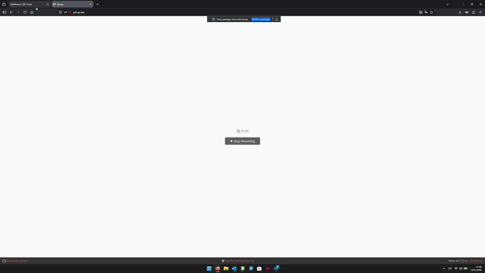

## 📖 Mode d’emploi

Cette page web permet de générer rapidement un **QR Code au format vCard** à partir d’une **signature e-mail copiée/collée**.

### Fonctionnement

1. **Copiez votre signature e-mail**  
   Sélectionnez et copiez l’intégralité de votre signature depuis votre client mail.

2. **Collez-la dans l’application**  
   Collez le texte brut dans le champ prévu à cet effet.

3. **Vérifiez les informations détectées**  
   L’application analyse automatiquement le contenu et remplit les différents champs (nom, téléphone, e-mail, organisation, etc.).  
   Contrôlez et modifiez les informations si nécessaire.

4. **Générez votre QR Code**  
   Une fois les données validées, cliquez sur le bouton de génération.

5. **Téléchargez le QR Code en PNG**  
   Le QR Code est exporté au format **PNG**, prêt à être :
   - ajouté comme **vCard** sur smartphone,
   - imprimé sur un support physique (badge, carte de visite, flyer, etc.),
   - partagé numériquement.

### Avantages

1. Rapide et simple d’utilisation  
2. Conversion automatique de signature → contact vCard  
3. Vérification manuelle avant génération  
4. Export en PNG haute qualité  
5. Compatible smartphone et tous supports numériques

## 🚀 Demo

